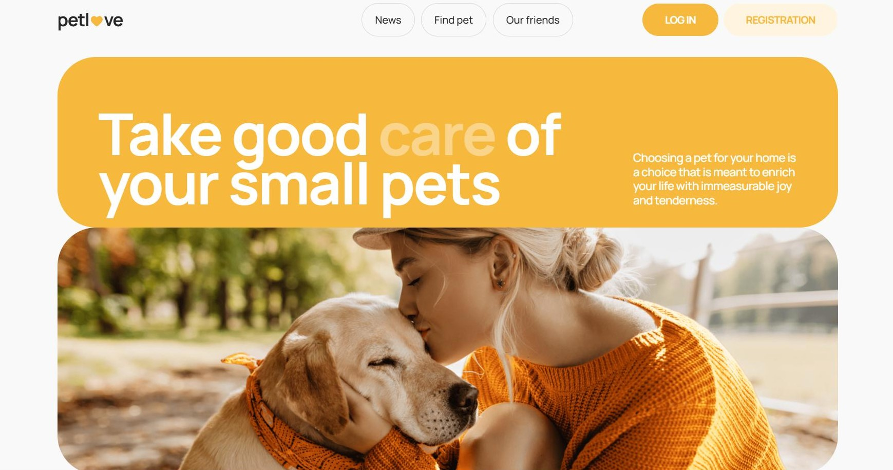

# Petlove

A convenient app for finding a pet

## Features

- Authorization and authentication
- Filter pets based on various criteria (type, species, gender)
- Save selected pets as favorites
- Enable pagination for browsing through the pets list

## Technologies used:

- React.js
- Redux Toolkit
- Styled Components
- Formik
- Typescript

## Live page

The live page can be accessed through the following link:
https://olena-rudnieva.github.io/pet-project-petlove

## Technical Specifications:

# Responsive Layout

Ensure responsiveness for mobile (320px and 375px), tablet (768px), and desktop
(1280px). Mobile layout should use a fluid approach (320px) and adaptive
approach (375px).

# Navigation and Routing

- Implement Nav with routes: /news, /notices, /friends.
- Use a burger menu for mobile/tablet.
- Create AuthNav for unauthenticated users with /register and /login.
- Create UserNav for authenticated users with UserBar and LogOutBtn.
